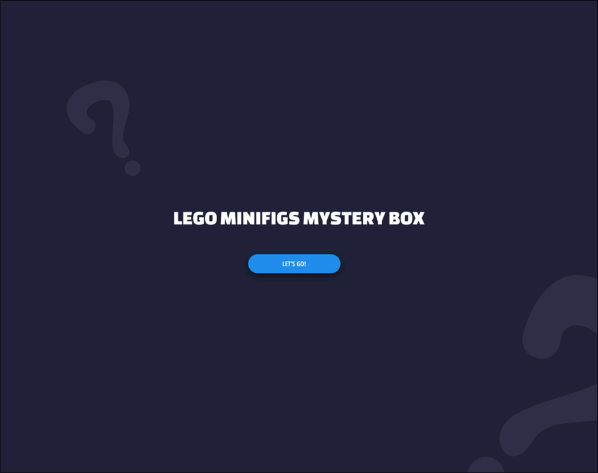
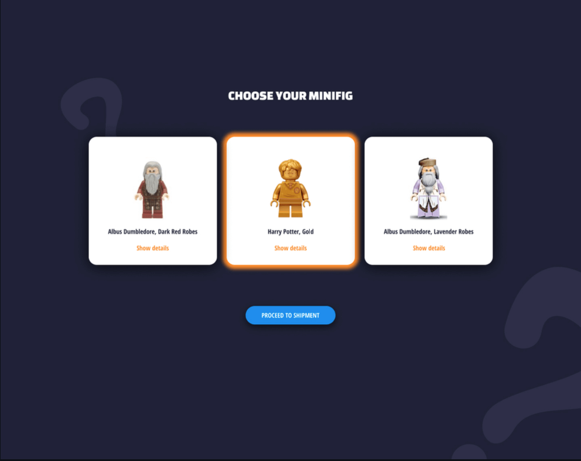
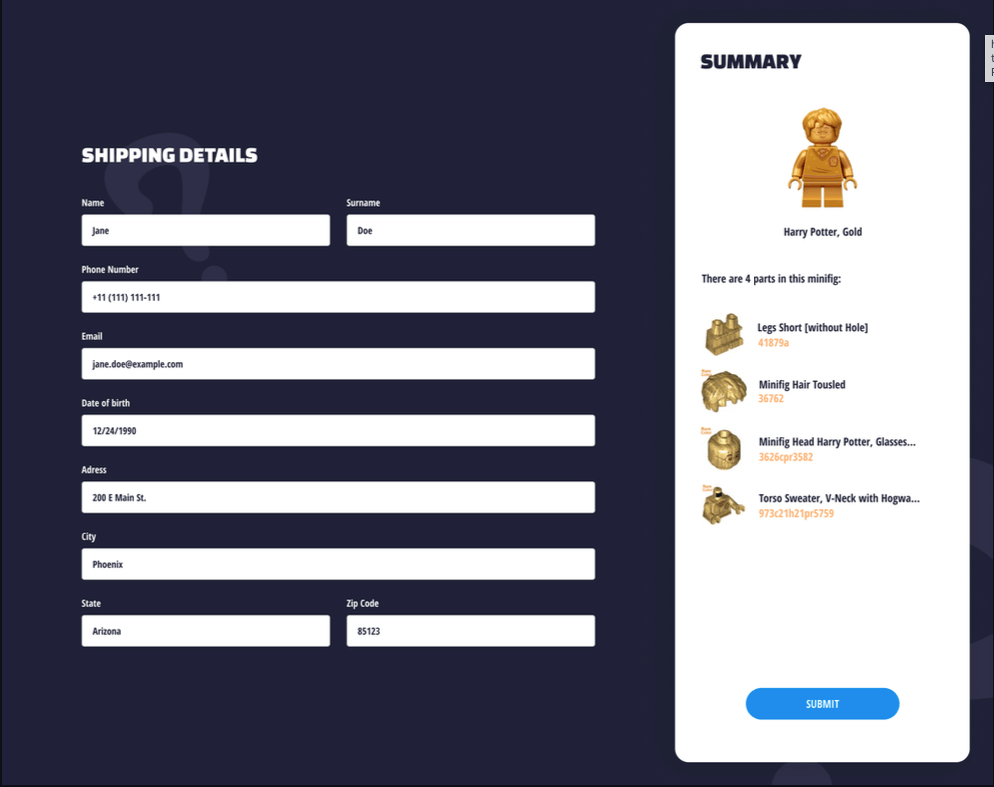

# Coding task - instructions

As part of our technical evaluation, we are giving you a take home coding assignment. This will allow you to demonstrate your current knowledge and skills. We want to see how you approach the challenge and execute in coding, logic and overall problem-solving.
We wish you the best of luck. Feel free to reach out if you have any follow-up questions.

## LEGO Harry Potter mystery box!

In this project, you’ll be coding a simple three-page application that allows users to draw three different LEGO mini figures (commonly referred to as a minifigs) from the Harry Potter series and get one of them free of charge. The first step contains a button that initiates the drawing. After successfully drawing three random minifigs, the user can choose one of the three random figures on the next screen. The last step contains the summary and shipping details form.
Down below, you’ll see we’ve included mock-ups for the app - you may use them directly or propose your own UI. They are here to help you grasp the concept.
Please use whatever libraries you find suitable to accomplish this task. Don't re-invent the wheel by developing you own form library.

## Rebrickable API

The list of Harry Potter minifigs can be fetched from one of the endpoints from the Rebrickable API. Please keep in mind that we are only looking for figures from the Harry Potter series. Rebrickable API also allows you to fetch a list of parts for each figure, which will come in handy.

## Requirements

### First page:

-   User is presented with a title, a mystery box image and a button
-   Clicking the button initiates the drawing process (API calls, choosing three random figures from the response etc.)
-   Successful drawing results in taking the user to the second step

### Second page:

-   User is required to select exactly one of the three random minifigs before moving to the next step
-   Selection is somehow indicated. In case of our mock-ups, the orange drop shadow is used
-   Show details button presents additional details about the minifig (you might use a modal, or redirect the user to Rebrickable page for this minifig)
-   "Proceed to shipment button" is enabled only when one of the figures is selected

### Third page:

-   The third page requires the user to fill out a generic shipment form. Each field should be validated. Please propose validation rules you find suitable from a functional / requirements perspective.
-   "Submit" button is enabled only when there are no validation errors.
-   Validation errors should be presented to the user (either below each field, or "globally")
-   User can see a summary of his order (a figure with all parts included)
-   Data should be submitted to a fake REST API service. Propose data structure that you find suitable for this use-case.
-   Once data is submitted, user should be taken back to the first step.

## Additional information for person that will check it:

-   Internet connection required (video included from external URL)
-   I created path of user in the way, that we download minifigs after click on button and random - but we keep these data even if user reload website, becuase it’s a mystery box - you can’t rotate it over and over. After all steps and when form is sent, everything is cleaned and user can start from begining (so if user click on the button in the first step api will fetch data)
-   I created some validation in form, but there could be more specific/detailed and powerful validation (we can say that is for TODO list in the future)
-   I apologize in advance for the slight mess in the summary step (lack of time)
-   I wrote also a few tests, but they are not super powerful

 
 
 

## Basic CRA Instructions

## Getting Started with Create React App

This project was bootstrapped with [Create React App](https://github.com/facebook/create-react-app).

## Available Scripts

In the project directory, you can run:

#### `npm start`

Runs the app in the development mode.\
Open [http://localhost:3000](http://localhost:3000) to view it in the browser.

The page will reload if you make edits.\
You will also see any lint errors in the console.

#### `npm test`

Launches the test runner in the interactive watch mode.\
See the section about [running tests](https://facebook.github.io/create-react-app/docs/running-tests) for more information.

#### `npm run build`

Builds the app for production to the `build` folder.\
It correctly bundles React in production mode and optimizes the build for the best performance.

The build is minified and the filenames include the hashes.\
Your app is ready to be deployed!

See the section about [deployment](https://facebook.github.io/create-react-app/docs/deployment) for more information.

#### `npm run eject`

**Note: this is a one-way operation. Once you `eject`, you can’t go back!**

If you aren’t satisfied with the build tool and configuration choices, you can `eject` at any time. This command will remove the single build dependency from your project.

Instead, it will copy all the configuration files and the transitive dependencies (webpack, Babel, ESLint, etc) right into your project so you have full control over them. All of the commands except `eject` will still work, but they will point to the copied scripts so you can tweak them. At this point you’re on your own.

You don’t have to ever use `eject`. The curated feature set is suitable for small and middle deployments, and you shouldn’t feel obligated to use this feature. However we understand that this tool wouldn’t be useful if you couldn’t customize it when you are ready for it.

#### Learn More

You can learn more in the [Create React App documentation](https://facebook.github.io/create-react-app/docs/getting-started).

To learn React, check out the [React documentation](https://reactjs.org/).
